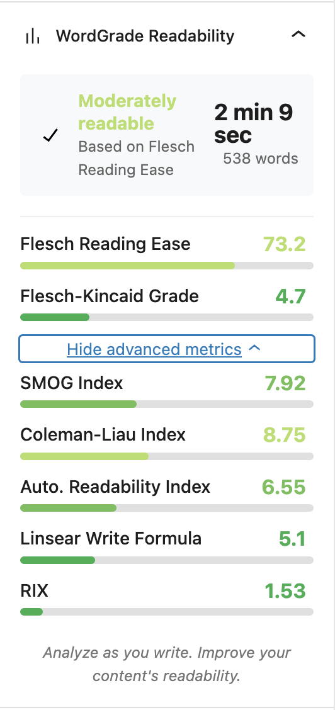

# WordGrade - WordPress Readability Analyzer

A WordPress plugin that provides real-time readability analysis in the editor. WordGrade calculates multiple readability metrics and presents them in a visually appealing interface to help writers create more accessible content.



## Features

- Real-time readability analysis as you write
- Visual representation of readability scores with color-coded meters
- Multiple readability metrics:
  - Flesch Reading Ease
  - Flesch-Kincaid Grade Level
  - SMOG Index
  - Coleman-Liau Index
  - Automated Readability Index
  - Linsear Write Formula
  - RIX Index
- Estimated reading time and word count
- Collapsible advanced metrics section
- Full integration with the WordPress Block Editor

## Installation

1. Download the latest release from the [releases page](https://github.com/yourusername/wordgrade/releases)
2. Upload the plugin to your WordPress site
3. Activate the plugin through the 'Plugins' menu in WordPress
4. Start writing in the block editor and see your readability metrics in the sidebar

Alternatively, search for "WordGrade" in the WordPress plugin directory and install directly from your admin dashboard.

## Usage

1. Create or edit a post or page in the WordPress Block Editor
2. Look for the WordGrade panel in the sidebar
3. As you write, your readability metrics will update in real-time
4. Use the scores to guide your writing for better readability

## Development

### Prerequisites

- Node.js and npm
- WordPress development environment

### Setup

```bash
# Clone the repository
git clone https://github.com/yourusername/wordgrade.git
cd wordgrade

# Install dependencies
npm install

# Build the plugin
npm run build
```

### File Structure

```
wordgrade/
├── build/                   # Compiled files
├── src/                     # Source files
│   └── index.js             # Main plugin file
├── assets/                  # Static assets
│   ├── css/                 # CSS files
│   └── images/              # Image files
├── languages/               # Translation files
├── wordgrade.php            # Plugin bootstrap file
├── readme.txt               # WordPress plugin readme
├── package.json             # npm package configuration
├── webpack.config.js        # Webpack configuration
└── README.md                # GitHub readme
```

## License

This project is licensed under the GPL v2.0 License - see the [LICENSE](LICENSE) file for details.

## Acknowledgments

- Inspired by readability research and tools like Hemingway and Yoast SEO
- Built with WordPress components and modern JavaScript